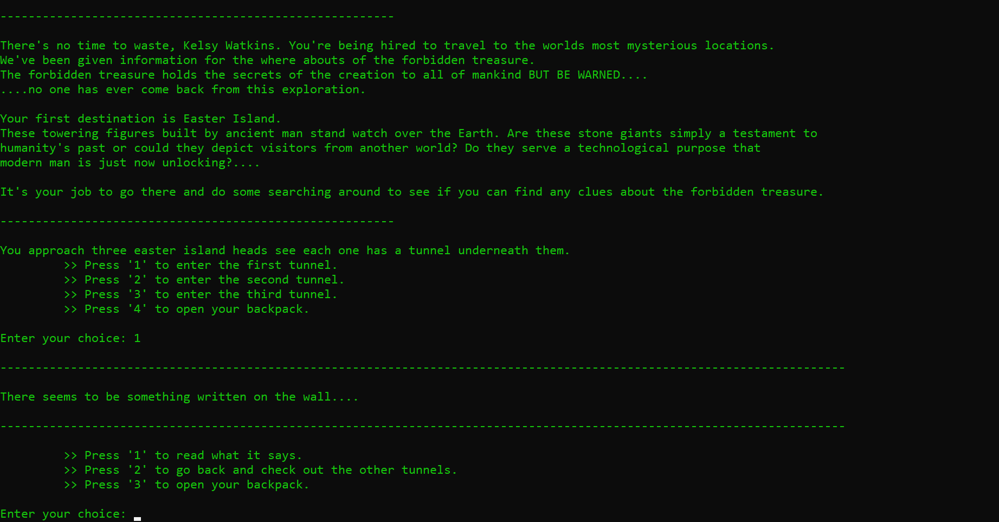
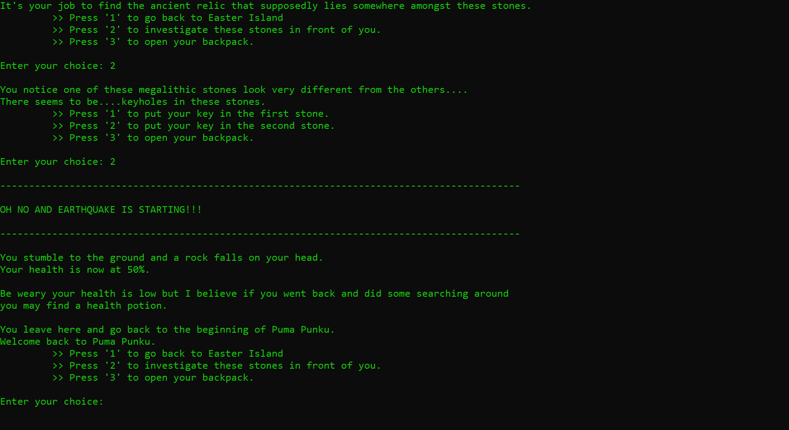

# Adventure-Lands
C++ CLI RPG Game

Adventure Lands is a C++, command line interface, role playing game. In this game you play the role of a hired explorer traveling all over the world to ancient megalithic sites. The end goal being to find the 'forbidden treasure' that unlocks the mysteries to mankind. Each destination you travel to is a level which presents obstacles you must overcome to continue on.

## Screenshots

